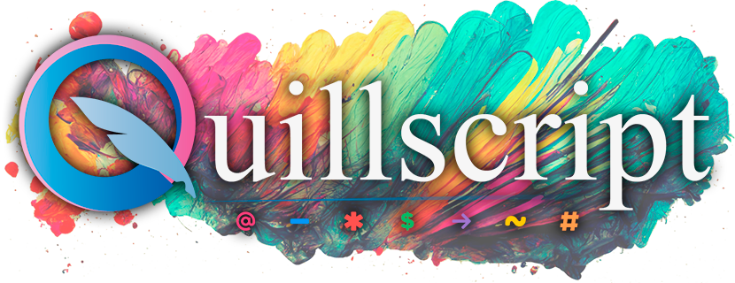

# v2.0

It's finally here. **_Snowfall version 2.0_**, now known as **Quillscript**, is its first official release and will become the main branch of the language from now onwards.

It's been a long road from 1.0 to 2.0, and many things have changed in the plugin design and core, but don't worry, it's still your well-known markup scripting language that resembles its predecessor and expands it in every way possible.

To keep pace with the new Unreal Engine 5, Quillscript is a complete rethink of how this plugin works and is written from scratch. It takes everything good in Snowfall and adds new tools and features. You can check an in-depth list of all changes and new features in the migration guide.

**Release Date:** 2023-05-23
**Engine Version:** 5.2

---
