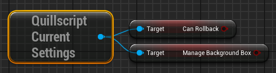

# v2.2


We are excited to announce Quillscript latest update, featuring four major new enhancements designed to improve developers' quality of life. Among other things, we introduce the **Variable Modifiers** feature, the **Checkpoint Directive**, and the **Sprite** and **TravelPass** built-in commands.

**Variable Modifiers** let you execute a custom function before a variable value is retrieved, allowing you to modify a variable value or run a required code before the variable is used. **Checkpoint** offers enhanced flow control to stop the Script until a condition is met in Blueprints/C++ code. Additionally, **Sprites** is an experimental new feature that brings a dynamic new layer to our interface with customizable, animated icons that enhance user interaction and visual appeal.

Alongside these significant upgrades, this update also includes various minor enhancements, extra helper functions, and bug fixes to improve overall performance and usability.

**Release Date**: 2024-04-23
**Engine Version**: 5.4

!!!warning
If you use **settings nodes**, check the [Possible Breaking Changes section](#possible-breaking-changes)
!!!

---

## <span class="command">Commands</span>

- Add <span class="command">$ TravelPass</span> built-in command
- Add <span class="command">$ Sprite</span> built-in command

---

## <span class="directive">Directives</span>

- Add <span class="directive">~ checkpoint</span> directive

---

## Script

- New **Variable Modifiers** feature
- Add **Is Script Playing** function
- Add **Is Any Script Playing** function
- Quillscript References can now pass **SubclassOf** parameters, as a _Script Reference Path_
- Quillscript can now capture **Soft Object**, **Soft Class**, and **Weak Pointer** references

---

## Interpreter

- Change the method **Option Selected** from private to public, to simplify code for self-managing UI developers
- Change how the **Audio Components** map is exposed to Blueprints, to allow direct access
- Add the **On Audio Finished** event, to track when a <span class="command">$ PlaySound</span> audio channel finishes to play
- Add an Interpreter reference outer parameter to the _OnStatementPlayed_, _OnScriptStarted_, _OnScriptResumed_, _OnEnded_, _OnPlayDialogueBox_, _OnPlaySelectionBox_ and _OnPlayBackgroundBox_

---

## Widgets

- Add the new **Sprite Box** creation, as an experimental feature
- Change the script widgets' creation time and lifecycle to be ready when a script starts to play, allowing widget functions and instances to be called and referenced anytime

---

## Settings

- Change how Quillscript handles settings, from the Unreal Engine settings defaults to an instanced object. (Check [Possible Breaking Changes](#possible-breaking-changes))
- Move Quillscript Settings from _Plugins_ category to _Game_ category
- Rename **SetSettingsAsset** to **UseSettingsAsset**
- Add **ClearSettingsAsset** function to stop using a previous given Settings Asset and use Plugin Settings instead
- Invoke **ClearSettingsAsset** when Quillscript Subsystem is created, to reset the Settings Asset reference. This helps to test game in editor and to ensure no Settings Asset is set on game startup

---

## Extra

- Add **Capture Widget** utility function
- Add **Sort Strings Alphabetically** utility function
- Add **Get Class Default Object** utility function
- Add **Call Function By Name** utility function
- Improve the **Remove Accentuation** function to deal with more foreign characters

---

## Fixes

- Fix an issue where the Blueprint won't compile when assigning **OnPlaySelectionBox**
- Fix <span class="command">&PlayerState</span> shortcut redirecting to **Player Controller**
- Fix an issue where a misleading error message prints when a script asset is moved to another folder
- Fix an issue where the Target object is reset to its previous value when _Update at Runtime_ is enabled
- Fix an issue preventing reference an array or map element in script
- Fix an issue where local script settings were overridden when using **PlayScriptUsingCustomSettings()** or **StartScriptUsingCustomSettings()**
- Fix an issue where Template Arguments can't have spaces between them
- Fix an issue where a false or _zeroed_ value UProperty could not be captured by script
- Fix an issue where the Interpreter Class on Script's settings won't update when the Interpreter is created manually using a class different from the default one
- Fix an issue where the wrong settings were verified before applying _Script Settings After_ **On Ended**
- Fix **Is Empty** macro inverted pins
- Fix audio components not stopping on script end
- Fix a crash when an **Audio Component** from the Interpreter were referenced after being garbage collected
- Fix a crash when a Default Class setting is null
- Fix a crash when the 'define' directive declaration and usage have a different number of parameters
- Fix a crash caused when an Interpreter's Audio Component were destroyed manually or automatically
- Minor performance improvements

---

## Possible Breaking Changes

!!!warning
**Settings Handling**

**In Blueprints**
Replace all occurrences of the settings' nodes, and get them as a property from the instanced settings object.



**In C++**

Replace all static function calls, and use the instanced singleton.

```cpp
UQuillscriptSettings::MethodName()         // From
UQuillscriptSettings::Get()->MethodName()  // To
```
!!!

---
