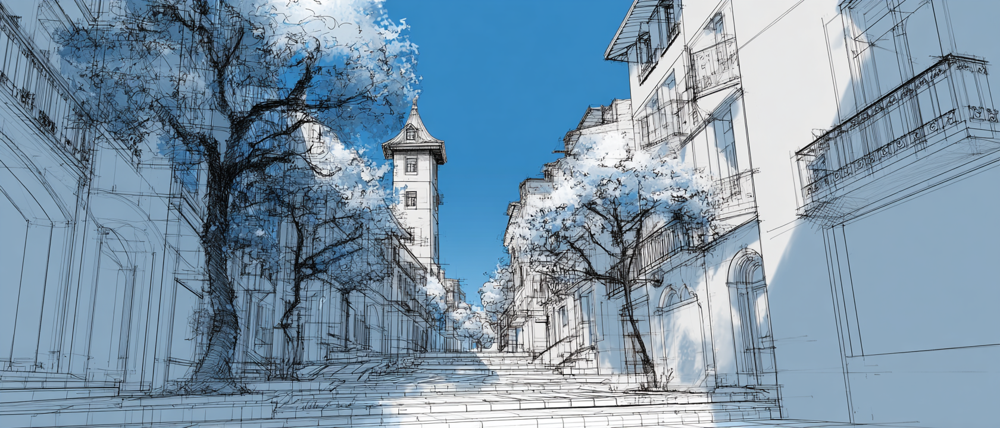

# v2.6

<!--  -->

**Release Date**: 202Y-MM-DD
**Engine Version**: 5.7

---

!!!
This version is a **work in progress**. It is not yet available for public use.

When a new feature is completed, it will be added to the list. Please note that this is not a complete list of all changes and improvements yet.

New features and improvements are being added regularly, so stay tuned for the final release!
!!!

---

## Scripts

- **Automatically generated labels**, for statements without a manually defined label, are now based on the script ID and the line content. Preserving labels across script edits.
- **Localization keys** now remain the same if the line is unchanged or has a manually defined label. This helps maintain consistency in localization files.

---

## Widgets

- The **Sprite Box** will find the animation by name automatically.

---

## Extras

- (Blueprint) Add the **Get Property Object** utility function
- (Blueprint) Add the **Get Parent Widget of Class** utility function
- (C++) Add the **Find Parent Widget of Class** utility function

---

 
 

## :icon-alert-fill: Breaking Changes

==- :icon-alert-fill: Sprite Box Animations
Before updating, make sure the **Sprite Box** animations names match exactly — case sensitive — the name used in script. Otherwise, the animation will not be found.
===

---
