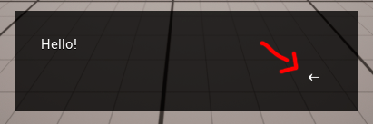

# Settings Details

Detailed explanation for each setting entry

---

## Interpreter

### Can Rollback
If enabled, the Interpreter keeps a list with the sequence of Dialogue statements played and Quillscript variables' state at that point, allowing the player to return to previously played dialogues to reread it if they missed something.

The _Built-in Dialog Box widget_ displays a rollback button when this setting is enabled.



### Auto Play Options Statements
If enabled, the Interpreter looks ahead of the current Dialogue statement; if the following statement is an Option statement, it is played automatically.

---

## Variables

### Default Variables
A collection of predefined Quillscript variables. they are initialized when the game is played.

This property is used to set variables that should exist since the beginning of a new game.

### Keep Visited Statements
Create a global Quillscript variable counter for each played statement with a label name in the format: `{ScriptId.LabelName}`.

This variable holds the number of times that statement was played.

### Keep Visited Labels
Create a global Quillscript variable counter for each played label statement in the format: `{ScriptId.LabelName}`.

This variable holds the number of times that label statement was played.

!!!warning
If [Keep Visited Statements](#keep-visited-statements) is enabled, the value of this setting takes no effect.
!!!

### Keep Selected Options
Create a global Quillscript variable counter for each selected option statement in the format: `{ScriptId.LabelName}`.

This variable holds the number of times the player selected a given option.

### Keep Last Selected Option Text
Create a system Quillscript variable holding the last selected option text, named `{$option}`.

```q
* Hi!
* Good day!

- Leanne
  I said: "{$option}"
```

---

## Editor

### Verbosity
Define where Quillscript help messages, and other messages using [Quillscript's print helper functions](todo), are printed. The messages can be printed in **screen** (top left corner), **console** or **neither**.

These messages are useful to keep track of what is happening in your script and under the hood, like variables, states, etc.

They can come in four forms:

- <span class="dialogue">Log (Blue)</span>: General information.
- <span class="command">Success (Green)</span>: Task performed successfully.
- <span class="directive">Warning (Yellow)</span>: A possible issue. They can be safely ignored, but preferably should be dealt with.
- <span class="option">Error (Red)</span>: Something went wrong and must be fixed.

---
