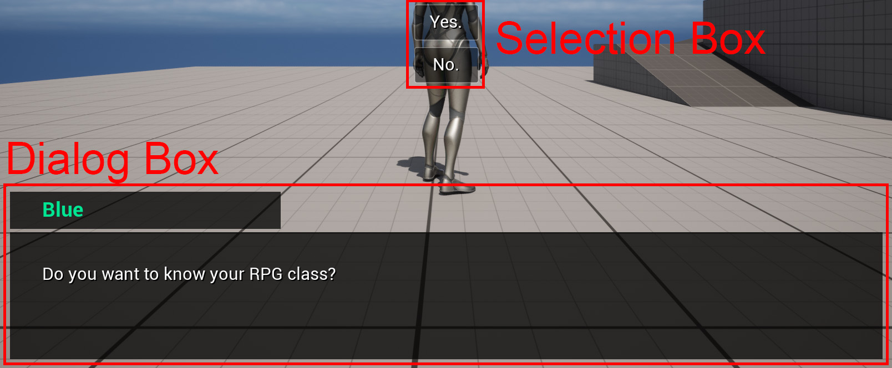
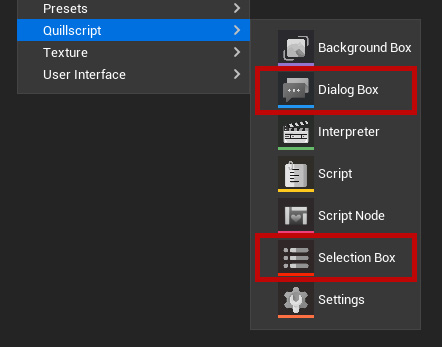

# Widgets

Quillscript uses 2 main widget base classes to receive data from the Script and show it to the player through the user interface. These widgets are Unreal Engine’s UMGs UI; therefore, they can be created, customized, and programmed using the same methods with no additional limitations.

[Dialog Box](./dialog-box.md)
:   Base class to show dialogue text

[Selection Box](./selection-box.md)
:   Base class to show player options

---

## Default Widgets
Quillscript provides a Default Widget for each base class.

Although fully functional, these default widgets are intended as basic examples and for general purposes, for most projects, it may be required to create custom widgets that suits better the project’s required functionalities, game design, visual identity, and aesthetics.

---

## Custom Widgets
If your project requires a custom widget, create a Blueprint/C++ Widget child of the respective base class. Quillscript provides shortcuts for this on its content browser’s menu.

Each class has a **Play** function that must be overridden by child widgets, this function is automatically called by the Interpreter and receives all data you need from the Script on each statement iteration.

---
