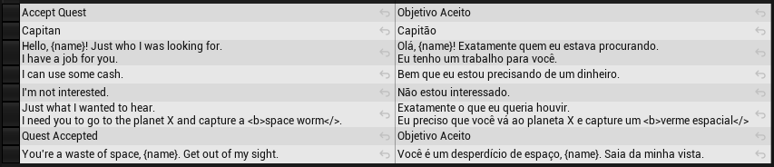
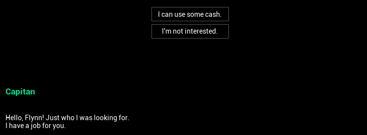
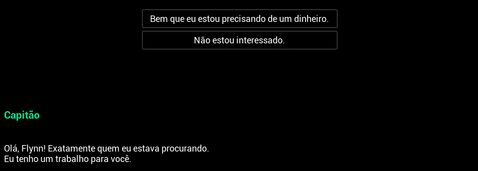

# Localization

Quillscript is localizable out of the box, meaning no setup or configuration is required to make your scripts localizable. Every text line in your script file is stored in the Quillscript asset as an Unreal Engine's Text type data, making it localizable as any other Text in the project.

This also means that the localization dashboard can gather your scripts' dialogues using the same method as other localizable data.

This article supposes the reader is familiarized with Unreal Engine's Localization Dashboard; if not, it's recommended to read <a href="https://docs.unrealengine.com/latest/ProductionPipelines/Localization/LocalizationTools/" target="_blank">this page from the documentation</a> and come back here after.

---

## Example
As an example, let's localize the following script from _English US (en-US)_ to _Brazilian Portuguese (pt-BR)_:

```q
SCENE - LOCALIZATION
====================
This script is a localization example.
It shows a small dialogue with most common localization use cases.

$ name := Flynn
$ captain := `Captain`

- {captain} | #happy
  Hello, {name}! Just who I was looking for.
  I have a job for you.

* I can use some cash. | -> Accept
* I'm not interested.  | -> Deny


<@> Accept
    Accept Quest

  - {captain}
    Just what I wanted to hear.
    I need you to go to the planet X and capture a <b>space worm</>.

    $ GiveQuest Fetch 'Space Worm' `Quest Accepted`


<@> Deny

  - {captain}
    You're a waste of space, {name}. Get out of my sight.
```

Let's analyze it line by line:

- **Lines 1 to 4** are header comments and are ignored by the parser; hence, they do not need localization.
- **Lines 6 and 7** set some naming variables. This is here for the sake of this example. Usually, such variables are set on a _"New Game"_, when the character is first met, or comes from another source, like a Blueprint or list. You can notice that the variable `{captain}` was set surrounded by **`` (_Backtics_)**, this marks this variable as localizable.
- **Line 9** is a dialogue header and is not localized, since it contains metadata such as speaker's names, conditions, and tags. In this specific case, the speaker's name must be localized, since it's a military hank, instead of a character name; for this reason, we used a previous localized variable here.
- **Lines 10 and 11** are the dialogue, what we most want to localize, and require no setup. Notice the use of the variable `{name}` here; when translated, this value must keep the same because it's not actual text, but data.
- **Lines 13 and 14** are player options and must be localized too, but not its Router target.
- **Lines 17 and 27** are labels that must keep as static text, meaning it can't be localized. But **line 18** is a _Label Display Name_, that may be displayed to players in some cases, and should be localized.
- **Line 24** is a custom function call, supposedly created for this game to give a quest to the player. It has 3 fictional parameters, and as you can see, only the last one is an actual text that is displayed to the player after accepting the quest, for that reason, it is surrounded by **backticks** also.

---

## Dashboard
Once you have your Localization Dashboard all set and configured to gather Quillscript Assets (Gather from package + assets directories), you can hit the gather button and open the "Edit Translation for This Culture" panel.

The first thing you can notice is that the metadata and non-localizable data is all cleaned automatically, and just the localizable relevant data is present.

After translating each entry, the resulting table should look like this:



And the result:




---
