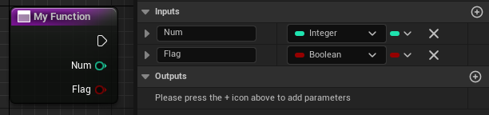
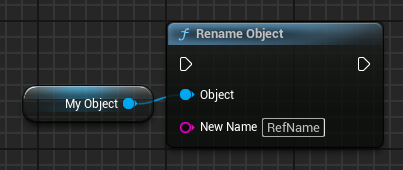
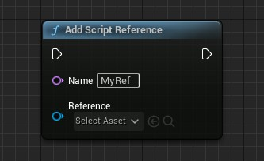
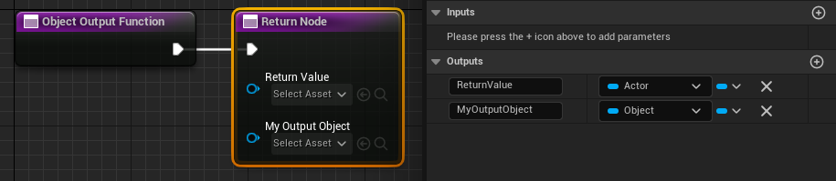
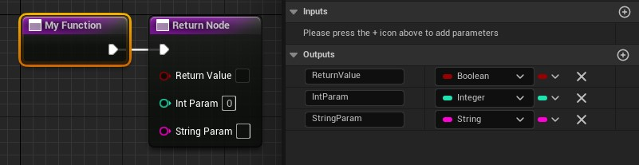
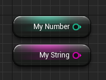
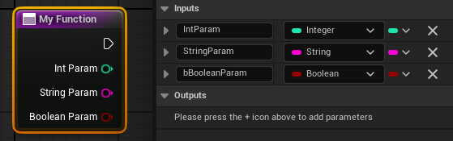

# Function Call

Quillscript can execute Blueprint/C++ functions using command lines.

Supposing you want to run a function with the following signature.

+++Blueprint

+++C++
```cpp
UFUNCTION()
void MyFunction(int32 Num, bool Flag);
```

!!!warning
Must be a **UFunction**
!!!
+++

!!!
By default, you can pass only primary type parameters: **Boolean (bool)**, **Byte (uint8)**, **Integer (int32)**, **Integer64 (int64)**, **Float (float/double)**, **String (FString)**, **Name (FName)**, **Text (FText)**, **Enumerators (UEnum)** and **Gameplay Tag (FGameplayTag)**.
!!!

!!!
Although not a recommended practice, you can pass **Null Pointers (nullptr)**, typing any string for that parameter. To pass a pointer to a valid reference, check [Script References](./function-call.md#script-references).
!!!

---

## <span class="command">Built-in</span>
If the above function belongs to the Interpreter, including custom interpreters, you call it by typing its name and passing the parameters separated by spaces.

```q
$ MyFunction 10 true

```

---

## <span class="command">Named Object</span>
You can execute functions that belong to an instanced object by referencing its name, editor's name or display name. For example, if an object is named 'MyActor', start the function with an **& (_ampersand_)** followed by the object name, and place a dot between the object name and the function name.

```q
$ &MyActor.MyFunction 10 true

```

Additionally, Quillscript also provides a **Rename Object** function to easily set a name for an object.

+++Blueprint

+++C++
```cpp
#include "Utils/Tools.h"
...

UTools::RenameObject(MyObject, "RefName");
```
+++

!!!warning
Avoid using whitespaces and special characters in object names for safety.
!!!

!!!danger
Although using the ~~object's editor's name~~ does work on the _Play-in-Editor_, and _development_ and _debug_ builds, it won't work on _distribution_ builds (shipping). Therefore, using the object's editor's name should be avoided and used only for quick testing and prototyping. **Use the object name or display name instead**.
!!!

### Shortcuts
You can use these names to reference common Unreal Engine objects.

| {.compact}
--- | ---
<span class="command">&GameInstance</span>         | Game Instance Object
<span class="command">&PlayerController</span>     | Player Controller Actor
<span class="command">&GameMode</span>             | Game Mode Object
<span class="command">&Pawn</span>                 | Player Pawn Actor
<span class="command">&Character</span>            | Player Character Actor
<span class="command">&GameState</span>            | Game State Object
<span class="command">&PlayerState</span>          | Player State Object
<span class="command">&PlayerCameraManager</span>  | Player Camera Manager Actor
<span class="command">&Interpreter</span> or <span class="command">&this</span> | This script interpreter Actor
<span class="command">&Target</span>               | Script target object (Passed in the Play Script node)
<span class="command">&Script</span>               | Script object
<span class="command">&DialogBox</span>            | Dialog Box Widget
<span class="command">&SelectionBox</span>         | Selection Box Widget
<span class="command">&BackgroundBox</span>        | Background Box Widget
<span class="command">&Level</span>                | Current Level Script Actor

### Script References
In addition, you can create a list of object references to use in scripts. To add an object to the list, use the method below:

+++Blueprint

+++C++
```cpp
#include "Utils/Quill.h"
...

UQuill::AddScriptReference(WorldContextObject, "MyRef", Reference);
```
+++

And it becomes available in script, by name.

```q
$ &MyRef.MyFunction 10 true

```

These objects can also be passed as parameter variables to other functions if they match parameter type. A null pointer is passed otherwise.

```q
$ MyOtherFunction {&MyRef}

```

!!!danger
Although the interpreter tries to check if the parameter type and the referenced object type are different, you should avoid passing an object with a different type, this can result in a crash.
!!!

Object references are also captured when they are sent as return value of a function. For example, the function with the following signature:

+++Blueprint

+++C++
```cpp
UFUNCTION()
AActor* ObjectOutputFunction(UObject*& MyOutputObject);
```

!!!warning
Must be a **UFunction**
!!!
+++

An object reference for the output parameter is added and becomes immediately available in script.

```q
$ &ReturnValue.MyFunction 10 true
$ &MyOutputObject.MyFunction 10 true

$ MyOtherFunction {&MyOutputObject}

```

#### Script Reference By Path
It's very common to pass an Unreal Engine asset as a parameter to a function. To avoid the need to create a named script reference for every asset required, script references can use the Unreal Engine path pattern to pass asset references without the need to previously name it.

```q
$ Background {&/Game/FolderName/AssetName.AssetName}

```

The same method can be applied to pass class references:

```q
// Blueprint classes.
$ MyFunction {&/Game/FolderName/MyBlueprint.MyBlueprint_C}

// C++ classes.
$ MyFunction {&Engine.Actor}

```

Script assets will also reference these assets in the [Reference Viewer](../../coding-and-design/editor/reference_viewer.md).

#### Script Reference Search Paths
Also, often your assets are all in the same folder. For such cases, you can add that folder to a list of **"Search Paths"**, either project-wide on plugin settings, or per script on the script asset itself. An asset in this specified folder does not need to be referenced by its entire path, but just by its name.

For example, suppose we have a folder named _"Backgrounds"_ on the content browser. Inside this folder are 3 texture assets named _"Classroom"_, _"Street"_, and _"Shop"_. You add this folder to your project search paths and reference these assets by name, without the need to create a script reference manually.

Search Path: `/Game/Backgrounds/`

```q
$ Background {&Classroom}
$ Background {&Street}
$ Background {&Shop}

```

---

## <span class="command">Object, Actors, Widgets or Function Library of Class</span>
You can execute functions in all objects of a given class. For example, if an object has the class _"MyClass"_, start the function with an **^ (_Circumflex_)** and the class name.

+++Blueprint Class
Start with the blueprint reference path, without the extension at the end:

```q
$ ^Path/To/My/Blueprint/MyClass.MyFunction 10 true

```

```q Example
$ ^Game/MyBlueprint.MyFunction 10 true

```
+++C++ Class
Start with the module name and the class name.

```q
$ ^MyModule.MyClass.MyFunction 10 true

```

```q Example
$ ^Engine.Actor.MyFunction 10 true

```
+++

---

## <span class="command">Tagged Actors</span>

You can execute functions that belong to instanced Actors using their tags. For example, if an Actor has the tag _'MyTag'_, start the function with a **% (_Percent Sign_)** and the tag name.

This method will execute the function in all actors with the specified tag.

```q
$ %MyTag.MyFunction 10 true

```

---

## <span class="command">Calling Nested Objects</span>
You can also call functions from nested objects. For example:

```q
$ MyParentObject.ChildObject1.ChildObject2.MyFunction 10 true

```

!!!warning
You cannot call functions from objects in **arrays**, **sets**, **maps**, and nested **structs**.
!!!

---

## <span class="command">Return Values and Outer Parameters</span>

### Functions
You can capture the return values of a called function and store it in a Quillscript variable.

Suppose you want to capture the return value of the following function.

+++Blueprint

+++C++
```cpp
UFUNCTION()
bool MyFunction(int32& IntParam, FString& StringParam);
```

!!!warning
Must be a **UFunction**
!!!
+++

When this function is called by one of the methods above, the return values are stored in **Quillscript Outer Variables**, a particular type of temporary variable that exists during that script execution.

These variables are named like the return value and outer parameters. The following variables are created in the example above: `$ReturnValue`, `$IntParam`, and `$StringParam`

```q # Example
$ &MyParentObject.MyFunction

$ double = {$IntParam} * 2

- Alice | ? {$ReturnValue} == on
  {$StringParam}
```

### Properties
You can capture the value of an UObject property.

Suppose you want to capture the return value of the following properties.

+++Blueprint

+++C++
```cpp
UPROPERTY()
int32 MyNumber;

UPROPERTY()
FString MyString;
```
!!!warning
Must be a **UProperty**
!!!
+++

Call the variable by its path and use the property name as an outer variable.

```q #
$ &MyParentObject.MyNumber

- Bob | ? {$MyNumber} > 5
  Hello!
```

And you can do the same for nested objects:

```q #
$ MyParentObject.ChildObject1.ChildObject2.MyString

- Alice
  {$MyString}
```

!!!warning
You cannot access properties from objects in **arrays**, **sets**, **maps**, and nested **structs**
!!!

It's also possible to retrieve an element from some container types using the :: separator.

From **Arrays** or **Sets** using the element index number:

```q
$ MyParentObject.MyArray

- Bob
  {$MyArray::0}
```

!!!warning
The following types are supported: **Boolean (bool)**, **Byte (uint8)**, **Integer (int32)**, **Integer64 (int64)**, **Float (float/double)**, **String (FString)** and **Name (FName)**.
!!!

From **Maps** using the element key:

```q
$ MyParentObject.MyMap

- Bob
  {$MyMap::key}
```

!!!warning
The following types are supported: **Boolean (bool)**, **Byte (uint8)**, **Integer (int32)**, **Integer64 (int64)**, **Float (float/double)**, **String (FString)**, **Name (FName)**, **Enumerators (UEnum)** and **Gameplay Tag (FGameplayTag)**.
!!!

---

## <span class="command">Localizing Parameters' Text</span>
Although being stored as an [Unreal Engine's Text type](https://dev.epicgames.com/documentation/unreal-engine/ftext-in-unreal-engine), Quillscript's Text are [culture-invariant](https://dev.epicgames.com/documentation/unreal-engine/ftext-in-unreal-engine) by default. If the value of a parameter must be localized, set its value inside **`` (_backticks_)** and it will be changed to [culture-correct](https://dev.epicgames.com/documentation/unreal-engine/text-localization-in-unreal-engine).

```q
// void MyFunction(FString Param1, FString Param2)
$ MyFunction `This param value should be localized` 'This param should not'

```

---

## <span class="command">Named Parameters</span>
Is a versatile feature that allows users to call functions with parameters passed in any order. This is achieved by explicitly naming the parameters using the @ParamName:ParamValue syntax. This approach enhances code readability and flexibility, making it easier to understand and edit. At the same time, it also lets the writer pass only the desired parameters in the desired order and omits unnecessary ones.

Consider the following function:

+++Blueprint

+++C++
```cpp
UFUNCTION()
void MyFunction(int32 IntParam, FString StringParam, bool bBooleanParam);
```
!!!warning
Must be a **UFunction**
!!!
+++

In a Quillscript file, you can call this function like this.

```q
// Same order, but named for better readability.
$ MyFunction @IntParam:10 @StringParam:String @bBooleanParam:true

// Parameters are passed in the writer's desired order.
$ MyFunction @bBooleanParam:true @StringParam:String @IntParam:10

// The intended param is passed, and others are omitted (default value).
$ MyFunction @StringParam:String
```

---