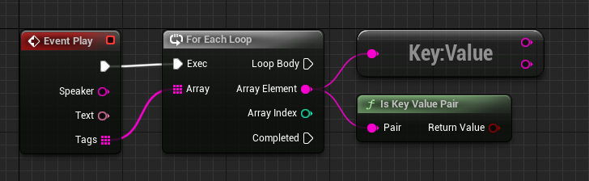

# Tag

Tags allow you to decorate your script statements for specific behaviors in custom widgets and Interpreters. They are just additional metadata to be used by your own Blueprints/Classes; they do nothing by default.

- A tag instruction starts with a **# (_Hashtag_)** followed by its name.

```q #
- Bob | #mytag
  Hello!

- Bob | #tag1 #tag2 #tag3
  Multiple tags in the same instruction.

- Bob | #tag1 | #tag2 | #tag3 #tag4
  Multiple tags concatenation.
```

!!!
You can place multiple tags in a single instruction or concatenate multiple instructions, both methods result in the same array of tags. A statement can have as many tags as required.
!!!

As a usage example, your project may have a [Dialog Box](../../coding-and-design/widgets/dialog-box.md) widget that shows your character expression when saying a sentence or a [Selection Box](../../coding-and-design/widgets/selection-box.md) widget that colorizes an option.

```q #
- Garfield | #angry | #fast
  I hate Mondays!

* Me too.       | #blue | #arrow_icon
* I don't care. | #red
```

Your custom widgets will receive these tags as an Array of Strings in its Play event 'Tags' parameter.

---

## Key-Value Pair
A tag can be formatted in a key-value pair pattern using : (Colon) like the example below.

```q #
- Sarah | #animation:idle
  Hello!

- Hank | #animation:smile
  Hey! Long time no see.
```

On your Interpreter or custom widget, you can check your tags and split the data.

+++ Apple

+++ C++
```cpp #
void UMyDialogBox::Play_Implementation(const FString& Speaker, const FText& Text, const TArray<FString>& Tags)
{
    for (auto& Tag : Tags)
    {
        if (UTools::IsKeyValuePair(Tag))
        {
            FString Key, Value;
            UTools::ToKeyValuePair(Tag, Key, Value);

            // My custom implementation for key-value pair.
        }
        else
        {
            // My custom implementation for non key-value pair.
        }
    }
}
```
+++

---

## Custom Patterns
Notice that tags are simple strings, meaning you can use custom patterns and formats to pass data, and later, you code your widgets and/or Interpreter to identify these patterns and act accordingly.

For example, you can write a tag using commas or semicolons and split the data later in your custom code.

```q
- Bob | #data1;data2;data3;data4
  Hello!

- Bob | #list=1,5,3
  Hello!

- Bob | #struct:name=move;location=0,0
  Hello!
```

---
