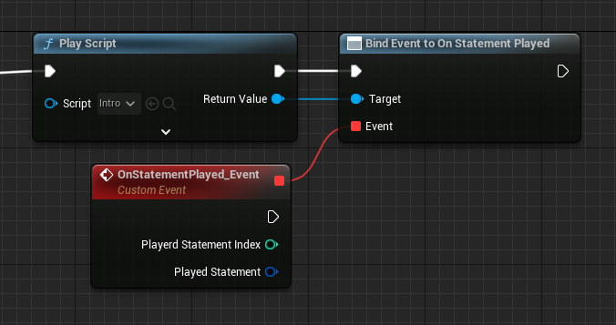
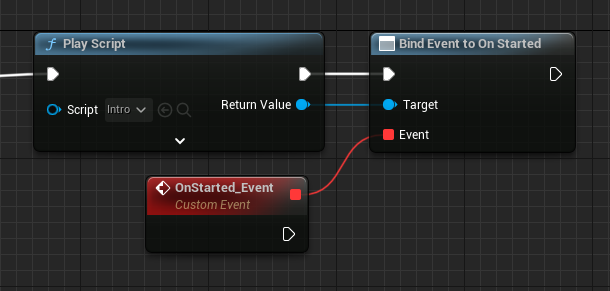
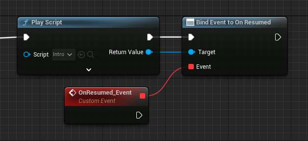
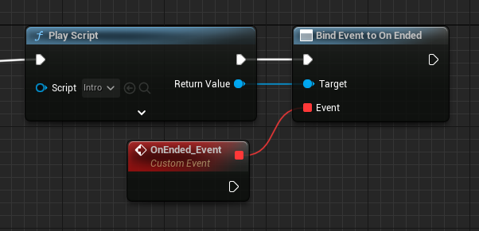
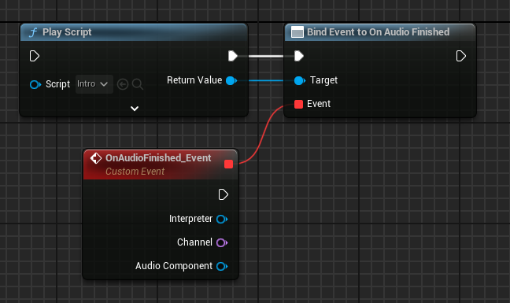
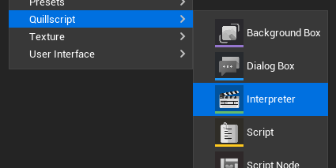
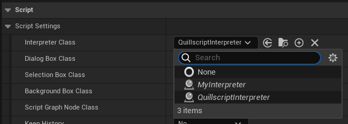

# Interpreter

The Interpreter object serves as a crucial component responsible for executing and interpreting the Script Asset. It acts as a bridge between the parsed script data and Unreal Engine's system.

This [Actor](https://docs.unrealengine.com/latest/ProgrammingAndScripting/ProgrammingWithCPP/UnrealArchitecture/Actors/) object is spawned in world when the **Play Script** function is executed, and it receives the Script Asset as input, analyzes the content one statement at a time, and executes the corresponding actions in real-time. It handles tasks such as playing statements, evaluating expressions, resolving variable references, and executing commands and story flow management.

---

## <span class="command">Built-In Functions</span>
The so called [built-in functions](../../language/command/built-in-functions.md) are methods of this object's class. That's why they do not require a prefix when called in a command statement, like with methods from other objects.

---

## <span class="command">Events</span>
The Interpreter has assignable events, related to a specific script play.

### Statement Played
This event fires when a script statement is played.

+++Blueprint

+++C++
```cpp !#7
#include "Utils/Quill.h"
...

TObjectPtr<UQuillscriptAsset> Script{ UQuill::GetScriptById("MyScriptId") };
TObjectPtr<AQuillscriptInterpreter> Interpreter{ UQuill::PlayScript(WorldContextObject, Script) };

Interpreter->OnStatementPlayed.AddDynamic(this, &UMyObject::OnStatementPlayed_Event);
```

```cpp
void UMyObject::OnStatementPlayed_Event(AQuillscriptInterpreter* Interpreter, int32 PlayedStatementIndex, FStatement PlayedStatement)
{
    // Implementation.
}
```
+++

### Script Started
This event fires when this script starts to play.

+++Blueprint

+++C++
```cpp !#7
#include "Utils/Quill.h"
...

TObjectPtr<UQuillscriptAsset> Script{ UQuill::GetScriptById("MyScriptId") };
TObjectPtr<AQuillscriptInterpreter> Interpreter{ UQuill::PlayScript(WorldContextObject, Script) };

Interpreter->OnStarted.AddDynamic(this, &UMyObject::OnStarted_Event);
```

```cpp
void UMyObject::OnStarted_Event(AQuillscriptInterpreter* Interprete)
{
    // Implementation.
}
```
+++

### Script Resumed
This event fires when this script is resumed.

+++Blueprint

+++C++
```cpp !#7
#include "Utils/Quill.h"
...

TObjectPtr<UQuillscriptAsset> Script{ UQuill::GetScriptById("MyScriptId") };
TObjectPtr<AQuillscriptInterpreter> Interpreter{ UQuill::PlayScript(WorldContextObject, Script) };

Interpreter->OnResumed.AddDynamic(this, &UMyObject::OnResumed_Event);
```

```cpp
void UMyObject::OnResumed_Event(AQuillscriptInterpreter* Interpreter)
{
    // Implementation.
}
```
+++

### Script Ended
This event fires when this script ends to play.

+++Blueprint

+++C++
```cpp !#7
#include "Utils/Quill.h"
...

TObjectPtr<UQuillscriptAsset> Script{ UQuill::GetScriptById("MyScriptId") };
TObjectPtr<AQuillscriptInterpreter> Interpreter{ UQuill::PlayScript(WorldContextObject, Script) };

Interpreter->OnEnded.AddDynamic(this, &UMyObject::OnEnded_Event);
```

```cpp
void UMyObject::OnEnded_Event(AQuillscriptInterpreter* Interpreter)
{
    // Implementation.
}
```
+++

### Play Dialogue Box
This event fires when the **Manage Dialogue Box** setting is off, and a Dialogue statement is played.

[Check Dialog Box](../widgets/dialog-box.md)

### Play Selection Box
This event fires when the **Manage Selection Box** setting is off, and a set of Options statements is played.

[Check Selection Box](../widgets/selection-box.md)

### Play Background Box
This event fires when the **Manage Background Box** setting is off, and the <span class="command">$ Background</span> or <span class="command">$ Bg</span> built-in function is played.

+++Blueprint

+++C++
```cpp !#7
#include "Utils/Quill.h"
...

TObjectPtr<UQuillscriptAsset> Script{ UQuill::GetScriptById("MyScriptId") };
TObjectPtr<AQuillscriptInterpreter> Interpreter{ UQuill::PlayScript(WorldContextObject, Script) };

Interpreter->OnPlayBackgroundBox.AddDynamic(this, &UMyObject::OnPlayBackgroundBox_Event);
```

```cpp
void UMyObject::OnPlayBackgroundBox_Event(AQuillscriptInterpreter* Interpreter, UTexture* Image, FString Transition, float Duration)
{
    // Implementation.
}
```
+++

### Audio Finished
This event fires when a $PlaySound audio finishes to play.

+++Blueprint

+++C++
```cpp
#include "Utils/Quill.h"
...

TObjectPtr<AQuillscriptInterpreter> Interpreter{ UQuill::PlayScript(WorldContextObject, Script) };
Interpreter->OnAudioFinished.AddDynamic(this, &UMyObject::OnAudioFinished_Event);
```

```cpp
void UMyObject::OnAudioFinished_Event(AQuillscriptInterpreter* Interpreter, const FName& Channel, UAudioComponent* AudioComponent)
{
    // Implementation.
}
```
+++

---

## <span class="command">Custom Interpreter</span>
If you want to add custom behavior to your story play, script execution, statements behavior, among other things, in most cases, you need a custom Interpreter.

The Quillscript Interpreter class is designed in a way you can override, add, and modify most of its core functions, like how a dialogue plays or a script ends.

!!!
You can check which functions are overridable and what they do in the **Blueprint's function override menu** or in the `QuillscriptInterpreter.h` header file.
!!!

To create a custom Interpreter, you need to create a Blueprint or C++ class child of
`AQuillscriptInterpreter`.

+++Blueprint

+++C++
```cpp #14 MyInterpreter.h
#pragma once

#include "CoreMinimal.h"
#include "QuillscriptInterpreter.h"
#include "MyInterpreter.generated.h"

UCLASS(BlueprintType)
class MYGAME_API AMyInterpreter : public AQuillscriptInterpreter
{
    GENERATED_BODY()

public:
    // Override the Play function as an example.
    virtual void Play_Implementation(const int32 StatementIndex) override;
};
```

```cpp # MyInterpreter.cpp
#include "MyFolder/MyInterpreter.h"


void AMyInterpreter::Play_Implementation(const int32 StatementIndex)
{
    // Implementation
}
+++

You can now override the required functions and add the desired behavior.

Then, in your [settings](../settings/) change the default class, if required, to the custom Interpreter class.



### Before Methods
The Before Methods are functions that runs before their respective flow function. This is most useful when you want to execute some tasks before a statement is played and do not want to override the base method, so you can implement these methods instead.

- Before Start
- Before Resume
- Before Play
- Before End
- Before Play Label
- Before Play Dialogue
- Before Play Option
- Before Play Command
- Before Play Router
- Before Play Condition
- Before Play Directive

---
