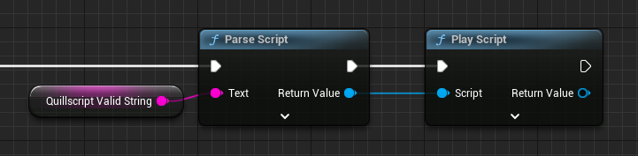

# Script

The Script Asset object represents your plain-text source script file in a format Unreal Engine can read and understand. It is created by the Lexer when you drag and drop your script file in Unreal Engine's content browser.

When the **Play Script** function is executed, the function creates an [Interpreter](./interpreter.md) and serves it a Script Asset to play.

---

## <span class="directive">Local Settings</span>
When opening a Script Asset in Editor, you can access and edit its local settings. Check [Script Local Settings](../settings/index.md#script-local-settings) page for more information.

---

## <span class="directive">Parsing</span>
Parsing a script refers to the process of analyzing the structure and syntax of a script. It involves breaking down the script into its individual components, such as keywords, operators, and expressions.

During parsing, each statement is converted into a [Struct](https://docs.unrealengine.com/latest/ProgrammingAndScripting/GameplayArchitecture/Structs/), and the Script Asset stores them in an array. The [Interpreter](./interpreter.md) then uses this array to further analyze and execute the statements into something the player can experience.

### Runtime Parsing
Quillscript allows parsing any valid string into a Script Asset, in editor and during runtime. This lets you create temporary scripts on demand, combining strings and code.

+++Blueprint

+++C++
```cpp
#include "Utils/Quill.h"
...

FString QuillscriptValidString{ "..." };
TObjectPtr<UQuillscriptAsset> Script{ UQuill::ParseScript(QuillscriptValidString) };
```
+++

!!!warning
You can combine this code with other Quillscript extra functions like Load Text File, to play modded or submitted scripts, on runtime. Be aware that since scripts can access and execute your game's code, this can be used to exploit your game. When parsing a script, the second parameter of the function defines its execution policy, or permissions.
!!!

---

## <span class="directive">Permissions</span>

### Permission Modes

#### All
All permissions, no exception. The default state a script plays.

This should be used only for your own scripts, since external sources can't be trusted.

#### Safe
Can play statements, but can't handle variables or call functions.

This mode is useful when external sources can play a story, but not execute game code.

- `PlayDialogues`, `PlaySelections`, `PlayRouters`, `PlayDirectives`

#### Sandbox
Play this script isolated in its own universe. Can play statements, can call built-in functions, and handle temporary variables.

This is most useful when modders should not have total access over game code but can create temporary variables and use the Interpreter's functions.

- `CallBuiltInFunctions`, `CreateTemporaryVariables`, `ModifyTemporaryVariables`, `DeleteTemporaryVariables`, `PlayDialogues`, `PlaySelections`, `PlayRouters`, `PlayDirectives`

---

## <span class="directive">Permissions</span>
You can also set script permissions manually.

- `CallBuiltInFunctions`
- `CallFunctionsByReference`
- `CallFunctionsByClass`
- `CallFunctionsByTag`
- `CreateGlobalVariables`
- `ModifyGlobalVariables`
- `DeleteGlobalVariables`
- `CreateTemporaryVariables`
- `ModifyTemporaryVariables`
- `DeleteTemporaryVariables`
- `PlayDialogues`
- `PlaySelections`
- `PlayRouters`
- `PlayDirectives`

+++Blueprint
!!!danger
For safety reasons, it is not possible to modify Script permissions using Blueprints, because to expose these methods to Blueprints means to expose these methods to the Script source file too. Allowing malicious user to modify their own permissions when writing a script.
!!!
+++C++
```cpp #2-4
Script->SetPermissions({
    EPermission::PlayDialogues,
    EPermission::PlaySelections,
    EPermission::CallBuiltInFunctions
});
```
+++

---
