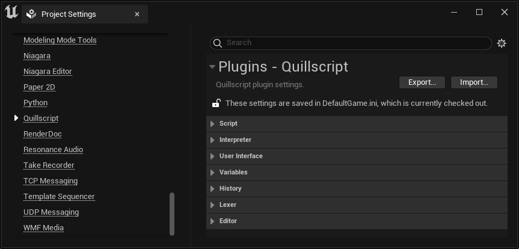
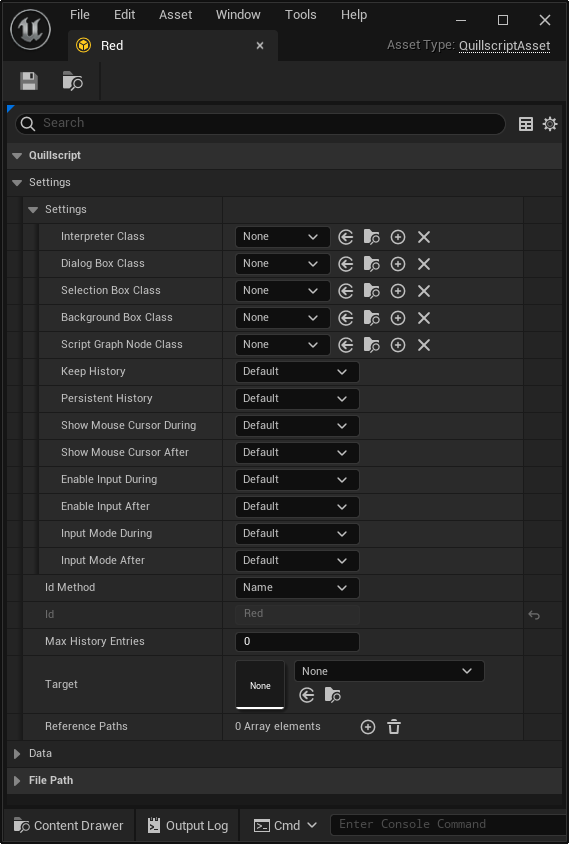
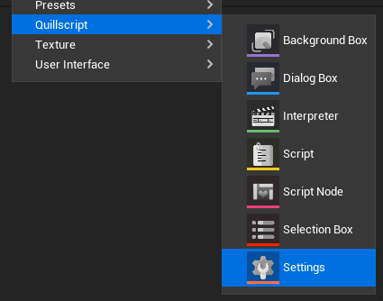
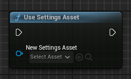
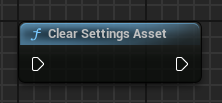
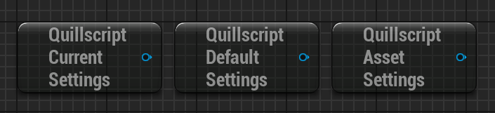

# Settings

You can configure and customize Quillscript's behavior through a myriad of settings.

There are 3 methods you can use to set custom settings: [Plugin Settings](#plugin-settings), [Script Local Settings](#script-local-settings), [Settings Asset](#settings-asset).

---

## <span class="tag">Plugin Settings</span>
You can find these settings at:

`Edit > Project Settings > Game > Quillscript`



These are project-wide public settings. Here you can customize default settings for the entire project, but it's not recommended for most cases, since its public nature, they are stored in .ini config files and are open for editing. This method should be avoided unless this is the desired behavior.

---

## <span class="tag">Script Local Settings</span>
You can find these settings in your Script Asset:



These are local settings for the given Script Asset only and do not contain all available settings, but only those related to Script play.

They have precedence over any other project settings and are enforced when in contradiction with settings from other sources. This should be used when the given script runs on different settings from the rest of the project.

---

## <span class="tag">Settings Asset</span>
This is the preferable method to create project-wide settings because it's protected from user editing. It is also more versatile, since you can have multiple assets with different setups and easily change between them during runtime.

You can create this asset using Quillscript's content browser menu:



It contains the same settings in [Plugin Settings](#plugin-settings), but asset settings take precedence over it.

To set a _Settings Asset_ as the current in-use settings:

+++Blueprint





+++C++
```cpp # Set
#include "Core/QuillscriptSettings.h"
...

// Get Settings Asset.
TObjectPtr<UQuillscriptSettings> SettingsAsset{
    UQuillscriptSettings::GetSettingsAssetByPath("/Game/MyAsset.MyAsset")
};

// Use Settings asset.
UQuillscriptSettings::UseSettingsAsset(WorldContextObject, SettingsAsset);

// Stop using Settings asset.
UQuillscriptSettings::ClearSettingsAsset();
```

```cpp # Get
#include "Core/QuillscriptSettings.h"
...

// Get the current in use settings asset or plugin settings.
UQuillscriptSettings::Get();

// Get the default settings in the plugin's settings.
UQuillscriptSettings::Default();

// Get the current in use settings asset.
UQuillscriptSettings::Asset();
```

!!!
The GetSettingsAssetByPath() is a helper function and is, of course, optional. You can get a reference to your Settings Asset by any other means.
!!!
+++

---
