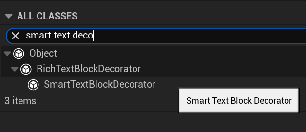
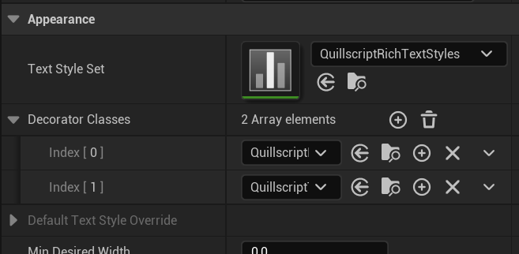
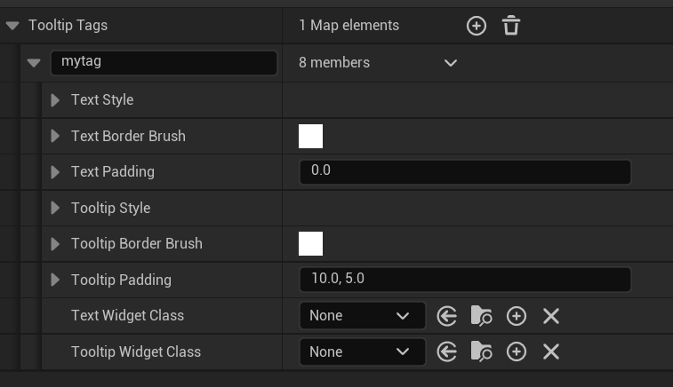
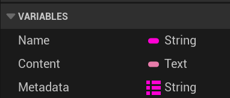

# Rich Text

---

## <span class="dialogue">Built-in Rich Text Tags</span>

Quillscript comes packed with a set of built-in rich text tags that can be used to format text in a Rich Text Block.

And you can also create your own custom rich text data table with custom tags, and apply it to any Rich Text Block, including to custom Dialog Box and Selection Box widgets.

The built-in Dialog Box and Selection Box widget supports the following tags:

Rich Text Tag | Source Text              | Formatted Text Result {.compact}
---           | ---                      | ---
b             | `<b>bold</>`             | **bold**
i             | `<i>italic</>`           | _italic_
bi            | `<bi>bold and italic</>` | **_bold and italic_**
u             | `<u>underline</>`        | <u>underline</u>
s             | `<s>strike</>`           | ~~strike~~
a             | `<a>anchor</>`           | <span style="color: blue; text-decoration: underline;">anchor</span>
info          | `<info>info</>`          | <span style="color: #00E592;">info</span>
warning       | `<warning>warning</>`    | <span style="color: #FFC107; font-style: italic;">warning</span>
danger        | `<danger>danger</>`      | <span style="color: #F44336; font-weight: bold">danger</span>
disable       | `<disable>disable</>`    | <span style="color: #666666; font-weight: 200">disable</span>
big           | `<big>big</>`            | <span style="font-size: 24px">big</span>
small         | `<small>small</>`        | <span style="font-size: 11px">small</span>

!!!
You can find the rich text **data table** at
`(Quillscript Folder) > Runtime > Utils > QuillscriptRichTextStyles`.
!!!

---

## <span class="dialogue">Image Decorator</span>

Please refer to the [Image Decorator](https://dev.epicgames.com/documentation/en-us/unreal-engine/umg-rich-text-block?application_version=4.27) documentation.

!!!ghost
:construction: Under construction :construction:
!!!

---

## <span class="dialogue">Tooltip Decorator</span>

Tooltips are floating text that appears when the mouse hovers over a specific area (substring). They are useful for providing additional information about a specific element or feature in your game.

### Tooltip Text Style

Show a tooltip text when a substring is hovered.

```q #
- .
  As the radiant light of the <wiki id="Solgem">Solgem</> waned,
  Elder Kael turned to you, his voice heavy with urgency.

- Elder Kael
  The <wiki id="Riftveil">Riftveil</> is growing unstable, and without the resources to mend it.
  You must journey to the <location tooltip="North of the Green River">Obsidian Hollows</> and
  retrieve the <wiki id="Emberheart">Emberheart</> before it's too late!
```


You can customize the tooltip text and content text style, including the background color or image.

For a more advanced tooltip, you can use a custom widget class to display the text and/or tooltip content; these widgets are just standard UMG, having no additional limitations; they are interactable and can be coded and styled to achieve the desired aesthetic and functionality.

### Smart Text Block Decorator

Add a tooltip widget to the viewport when a substring is hovered

### Create a Tooltip Style

Create a new blueprint from the base class.



Select your text block and add your new decorator class.



In the newly created blueprint, add a new entry to the **Tooltip Tags** array.



Here you can customize the appearance of the source text content and the tooltip text.

Now, when you add the tag attribute `tooltip` to a substring, the tooltip will be displayed when the mouse hovers over it.

```q
- Bob
  Hello, <mytag tooltip="Alice's brother">Bob</>!
```

### Tooltip Widget

If you set a **Widget Class**, the text and/or tooltip will be displayed as a custom widget instead.

The used **Widget Class** must have 3 required variables, where Quillscript will inject the data you need to display information inside your widget.



Variable     | Type                                    | Data {.compact}
---          | ---                                     | ---
**Name**     | String `FString`                        | The name of the rich text tag used
**Content**  | Text `FText`                            | The content text inside of the rich text tag
**Metadata** | Map of Strings `TMap<FString, FString>` | The metadata attributes of the rich text tag

!!!warning
**For C++ Widgets**
These variables must be **UProperty**
!!!

---
