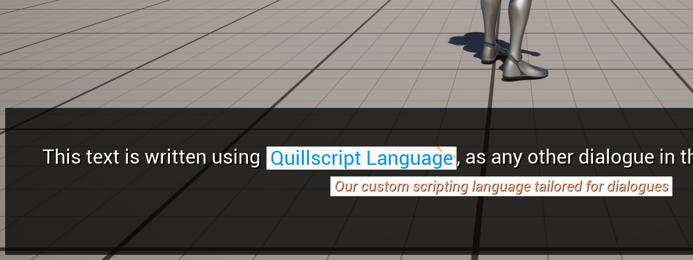

# Rich Text

---

## <span class="dialogue">Built-in Tags</span>

!!!ghost
:construction: Under construction :construction:
!!!

---

## <span class="dialogue">Image Decorator</span>

Please refer to the [Image Decorator](https://dev.epicgames.com/documentation/en-us/unreal-engine/umg-rich-text-block?application_version=4.27) documentation.

!!!ghost
:construction: Under construction :construction:
!!!

---

## <span class="dialogue">Tooltip Decorator</span>

Tooltips are floating text that appears when the mouse hovers over a specific area (substring). They are useful for providing additional information about a specific element or feature in your game.

### Tooltip Text Style

Show a tooltip text when a substring is hovered.

```q
- .
  This text is written using <data tooltip="Our custom scripting language tailored for dialogues">Quillscript Language</>, as any other dialogue in this project.
```



You can customize the tooltip text and content text style, including the background color or image.

### Smart Text Block Decorator

Add a tooltip widget to the viewport when a substring is hovered

### Create a Tooltip Style

Create a new blueprint from the base class.


Select your text block and add your new decorator class.


In the newly created blueprint, add a new entry to the **Tooltip Tags** array.


Here you can customize the appearance of the source text content and the tooltip text.

If you set a **Widget Class**, the text or tooltip will be displayed as a widget instead of a text and any related style setting is ignored.

The selected **Widget Class** must have 3 required variables, where Quillscript will inject the data you need to display information inside your widget.


---
