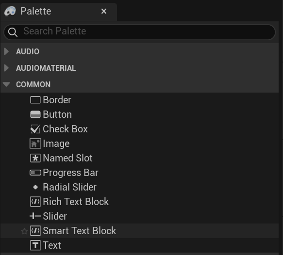
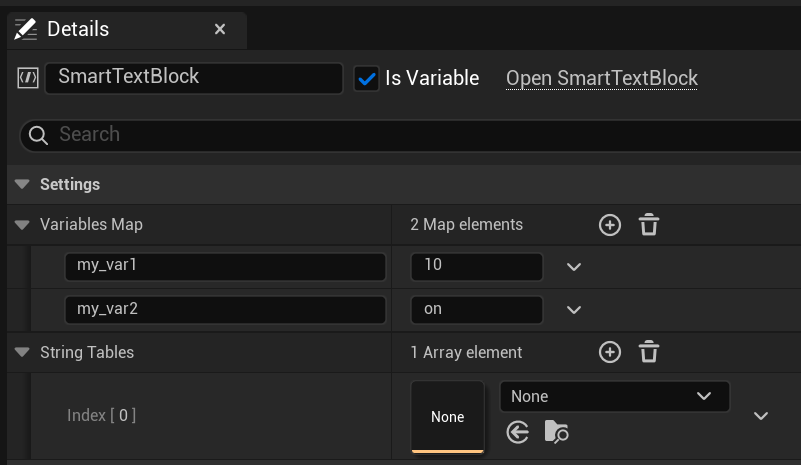
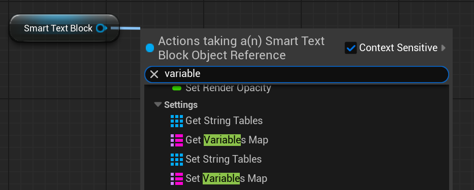

# Smart Text Block

The Smart Text Block is a custom [Rich Text Block](https://dev.epicgames.com/documentation/en-us/unreal-engine/umg-rich-text-block?application_version=4.27) that automatically applies a replace function to substitute [Quillscript variables](../../language/command/quillscript-variables.md) and other supplied key value pairs. It will behave as a normal Rich Text Block for all cases, but with the added functionality.

---

## Usage

To add a Smart Text Block to your widget, it can be found in the palette under the `Common` category.

In the details panel, you can set any additional key value pairs that you want to use in the replace function. It can also use a [String Table](https://dev.epicgames.com/documentation/unreal-engine/using-string-tables-for-text-in-unreal-engine) as a source for the key value pairs.

Additionally, this properties can be set from code.

---
