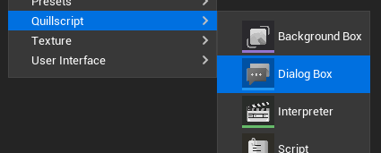
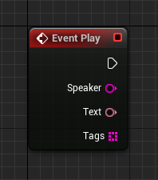
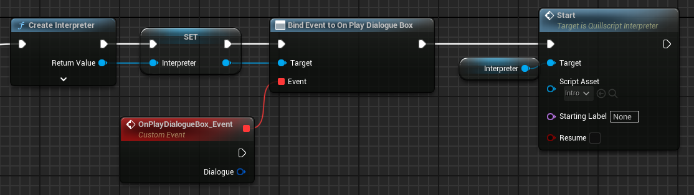

# Dialog Box

The Dialog Box is a widget the Quillscript Interpreter uses to display dialogue lines to the player, including the speaker's name. Every Dialogue statement in your script is displayed on the screen through a Dialog Box widget.

Example:


Quillscript Plugin provides a built-in Dialog Box widget. Although fully functional, the default widget is intended as a basic example for general purposes. For most projects, it may be required to create custom widgets that suits better the project’s required functionalities, game design, visual identity, and aesthetics.

---

## <span class="dialogue">Create a Custom Dialog Box</span>
To create your own Dialog Box widget, it must conform with two requirements:

**Be a child class of the Dialog Box Base class (Blueprint or C++)**

Quillscript provides a convenient shortcut for that on the content browser menu.



!!!
You will be prompted to copy the built-in Dialog Box widget or create a blank one from scratch.
!!!

**Implement the Play function from the parent class**

+++Blueprint

+++C++
```cpp #13 MyDialogBox.h
#pragma once

#include "CoreMinimal.h"
#include "widgets/DialogBox.h"
#include "MyDialogBox.generated.h"

UCLASS()
class MYGAME_API UMyDialogBox : public UDialogBox
{
    GENERATED_BODY()

public:
    virtual void Play_Implementation(const FString& Speaker, const FText& Text, const TArray<FString>& Tags) override;
};
```

```cpp # MyDialogBox.cpp
#include "Mywidgets/MyDialogBox.h"


void UMyDialogBox::Play_Implementation(const FString& Speaker, const FText& Text, const TArray<FString>& Tags)
{
    // Implementation.
}
```
+++

!!!
The Play event is called by the Interpreter for every Dialogue statement.
!!!

---

## <span class="dialogue">Use Custom Dialog Box</span>
Once your Dialogue Box is done, you can use it by setting your _Default Dialogue Box Class_ in [Quillscript Settings](../settings/) or change it on demand using the built-in function <span class="command">$ Use</span>.

---

## <span class="dialogue">Self-Manage Dialog Box</span>
For some projects, Quillscript user interface management may be incompatible with its design or code. For these cases, you can turn off UI management in Quillscript Plugin settings.

`Settings > User Interface > Advanced > Manage Dialogue Box`

When disabled, the Interpreter will no longer manage the lifecycle of the Dialogue Box, and it is up to you to create, update, delete, etc., your widget. This widget is not required to be a child class nor implement the Play event.

You can assign to the **On Play Dialogue Box** event, to be notified when a dialogue box should play.

+++Blueprint

+++C++
```cpp
#include "Utils/Quill.h"
...

const TObjectPtr<AQuillscriptInterpreter> Interpreter{ UQuill::CreateInterpreter(WorldContextObject) };
Interpreter->OnPlayDialogueBox.AddDynamic(this, &UMyObject::PlayDialogue);
Interpreter->Start_Implementation(UQuill::GetScriptById("MyScriptId"));
```

```cpp
void UMyObject::PlayDialogue(AQuillscriptInterpreter* Interpreter, FStatement Dialogue)
{
    // Implementation.
}
```
+++

---
