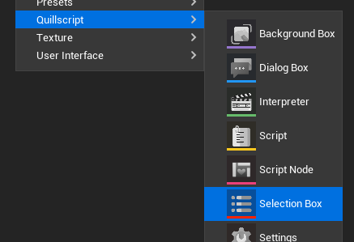
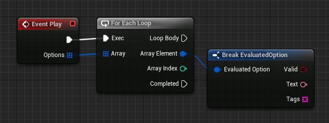
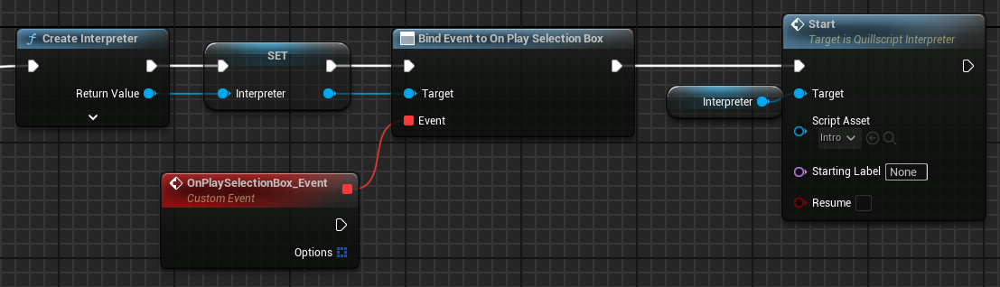

# Selection Box

The Selection Box is a widget the Quillscript Interpreter uses to display option lines to the player, including the evaluated condition. Every Option statement set in your script is displayed on the screen through a Selection Box widget.

Example:


Quillscript Plugin provides a built-in Selection Box widget. Although fully functional, the default widget is intended as a basic example for general purposes. For most projects, it may be required to create custom widgets that suits better the project’s required functionalities, game design, visual identity, and aesthetics.

---

## <span class="option">Create a Custom Dialog Box</span>
To create your own Selection Box widget, it must conform with two requirements:

**Be a child class of the Selection Box Base class (Blueprint or C++)**
Quillscript provides a convenient shortcut for that on the content browser menu.



!!!
You will be prompted to copy the built-in Selection Box widget or create a blank one from scratch.
!!!

**Implement the Play function from the parent class**

+++Blueprint

+++C++
```cpp # MySelectionBox.h
#pragma once

#include "CoreMinimal.h"
#include "widgets/SelectionBox.h"
#include "MySelectionBox.generated.h"

UCLASS()
class MYGAME_API UMySelectionBox : public USelectionBox
{
    GENERATED_BODY()

public:
    virtual void Play_Implementation(const TArray<FEvaluatedOption>& Options) override;
};
```

```cpp # MySelectionBox.cpp
#include "Mywidgets/MySelectionBox.h"


void UMySelectionBox::Play_Implementation(const TArray<FEvaluatedOption>& Options)
{
    for (auto& Option : Options)
    {
        if (Option.bValid)
        {
            // Implementation.
        }
        else
        {
            // Implementation.
        }
    }
}
```
+++

!!!
The Play event is called by the Interpreter for every Option statement set.
!!!

The Options parameter is an array containing data from each Option statement, including text and tags.

The **Valid** property is a _Boolean_ value storing the evaluated result of all condition instruction in this option. This means that the Interpreter does not remove or jump failed options as it does with Dialogue statements, but instead, it lets the widget decide what to do with them; the most common behavior is to remove, gray out, or lock failed options.

---

## <span class="option">Use Custom Selection Box</span>
Once your Selection Box is done, you can use it by setting your _Default Selection Box Class_ in [Quillscript Settings](../settings/) or change it on demand using the built-in function <span class="command">$ Use</span>.

---

## <span class="option">Self-Manage Selection Box</span>
For some projects, Quillscript user interface management may be incompatible with its design or code. For these cases, you can turn off UI management in Quillscript Plugin settings.

`Settings > User Interface > Advanced > Manage Selection Box`

When disabled, the Interpreter will no longer manage the lifecycle of the Selection Box, and it is up to you to create, update, delete, etc., your widget. This widget is not required to be a child class nor implement the Play event.

You can assign to the **On Play Selection Box** event, to be notified when a dialogue box should play.

+++Blueprint

+++C++
```cpp
#include "Utils/Quill.h"
...

const TObjectPtr<AQuillscriptInterpreter> Interpreter{ UQuill::CreateInterpreter(WorldContextObject) };const TObjectPtr<AQuillscriptInterpreter> Interpreter{ UQuill::CreateInterpreter(WorldContextObject) };
Interpreter->OnPlaySelectionBox.AddDynamic(this, &UMyObject::PlaySelection);
Interpreter->Start(UQuill::GetScriptById("MyScriptId"));
```

```cpp
void UMyObject::PlaySelection(AQuillscriptInterpreter* Interpreter, TArray<FStatement> Options)
{
    // Implementation.
}
```
+++

---
