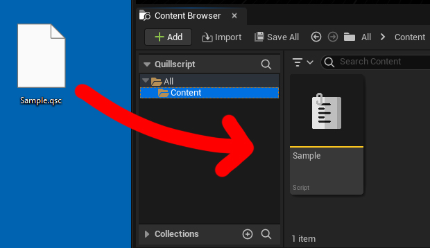
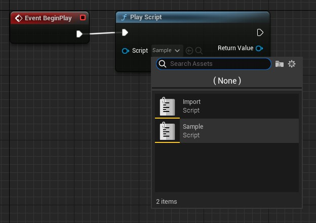

# Getting Started

If you are a beginner with Quillscript Plugin, this article helps you start from scratch.

Follow the steps below to get your project up and running and create your own stories.

!!!
You can also download our <a href="https://1drv.ms/f/s!AhimAtOsSqD6ifgusJ6qDCQoOnD1ZA?e=UhbR5N" target="_blank">sample project</a>.
!!!

<br>

## Step by Step

- **Step 1 - Enable Quillscript in your Project**
    - <a href="https://dev.epicgames.com/documentation/unreal-engine/working-with-plugins-in-unreal-engine#installingpluginsfromtheunrealenginemarketplace" target="_blank">Add Quillscript to the Engine</a> through the <a href="https://store.epicgames.com/download" target="_blank">Epic Games Launcher</a>
    - Create and/or start a project
    - Go to `Edit > Plugins > Installed > Gameplay` and enable _Quillscript_
    - Restart the Editor
<br>

- **Step 2 - Write your Story**
    - Create a **plain text** file using your preferred text editor software and write your story following _Quillscript Language_ rules. Save it with a **.qsc** extension.
    <br>
    > We provide <a href="https://1drv.ms/f/s!AhimAtOsSqD6ifgw3m5MFBZ7Pufmqg?e=d8TKKN" target="_blank">sample scripts</a> you can use to test and experiment.

    - Drag your script file into Unreal Editor's content browser. This action will generate a **Quillscript Asset**, which is a resource that contains your script and can be used within the Unreal Editor for various purposes.
    
<br>

- **Step 3 - Play your Story**
    - Go where you want to start your story, add a **Play Script** node, and select your new **Quillscript Asset**.
    <br>

    +++ Blueprint
    

    !!!
    For the sake of this guide, we're starting the story at the **Begin Play** event of the open Level, but you can use this node wherever fits your case better, like a collision box overlapping event or button click event.
    !!!
    +++ C++
    ```cpp #5
        #include "Utils/Quill.h"
        ...

        TObjectPtr<UQuillscriptAsset> Script{ UQuill::GetScriptById("MyScriptId") };
        UQuill::PlayScript(WorldContextObject, Script);
    ```
    +++
<br>

> Play your game, and watch your story happen

---

## Video Tutorial

[!embed](https://www.youtube.com/watch?v=_R2vaD6wkdg)

---

## Where Should I Go Next?
The recommended next step is to familiarize yourself with the base language elements: [Dialogue](./language/dialogue/), [Option](./language/Option), [Label](./language/Label), [Router](./language/Router), [Command](./language/Command), [Condition](./language/Condition), [Directive](./language/Directive), [Tag](./language/Tag), and [Comment](./language/Comment).

When you feel confident that you know and understand the basics of each language element, we recommend you move to the **Guides** or **Coding and Design** sections.

Neither of those sections is required to be read in order; they are meant to be standalone guides, although often, it is considered that you have a basic understanding of prerequisite elements.

---
